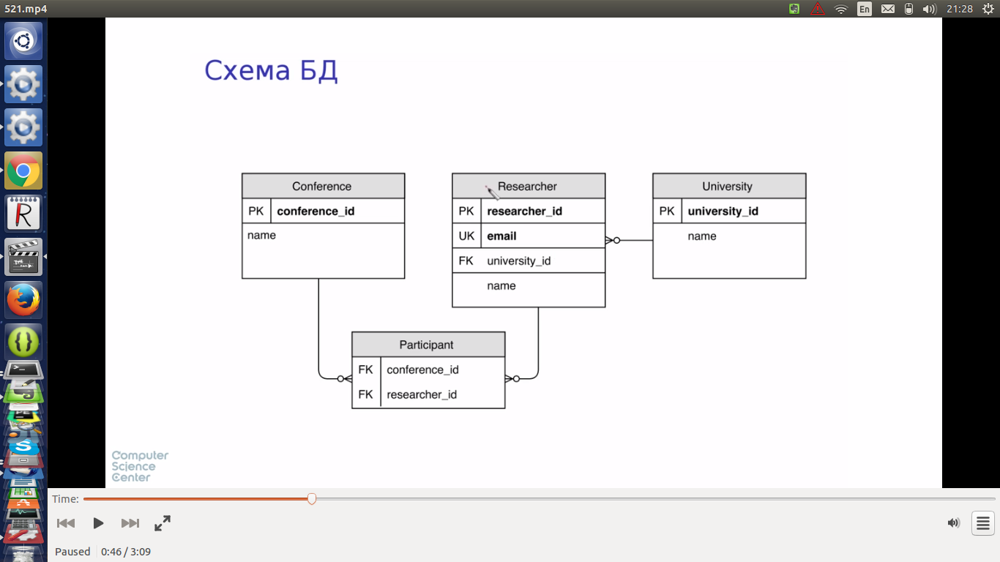
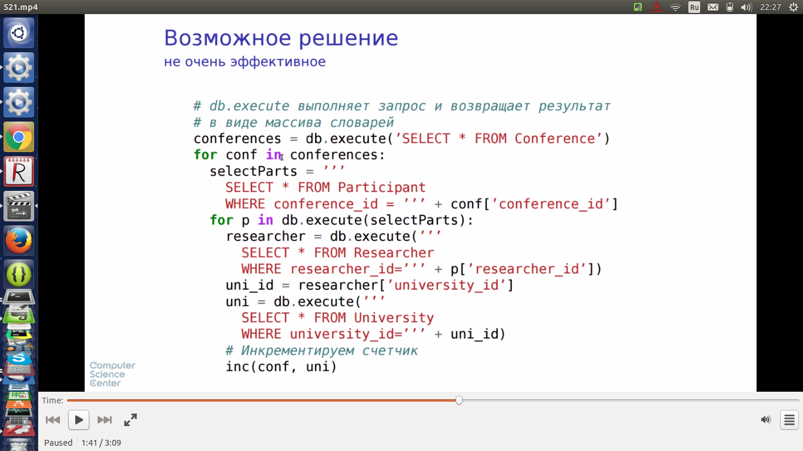
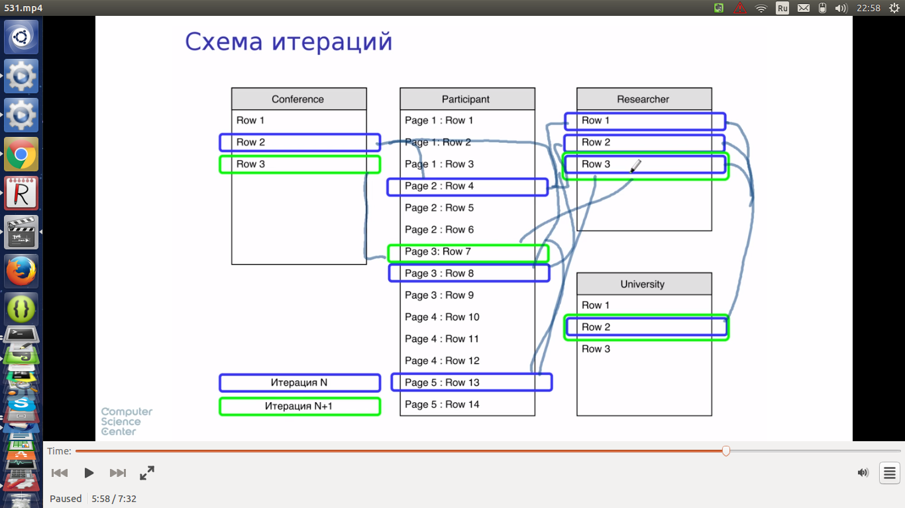
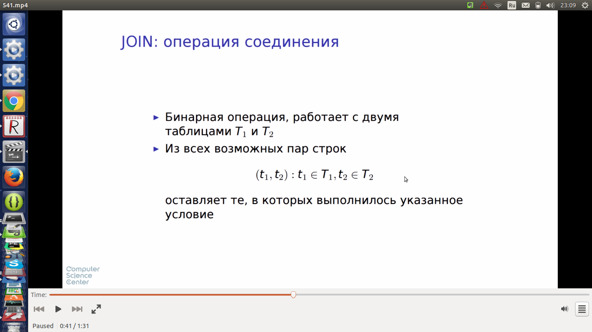
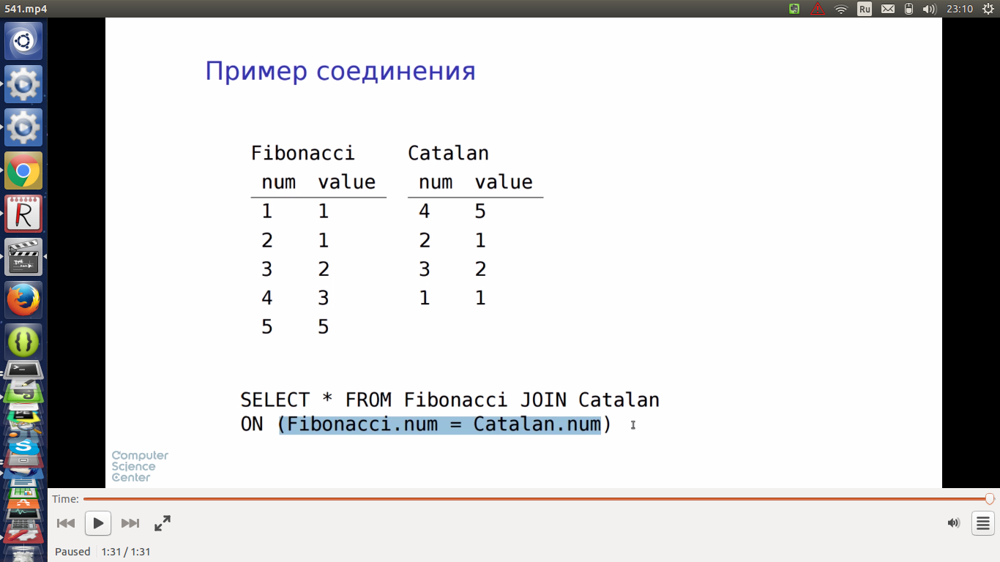
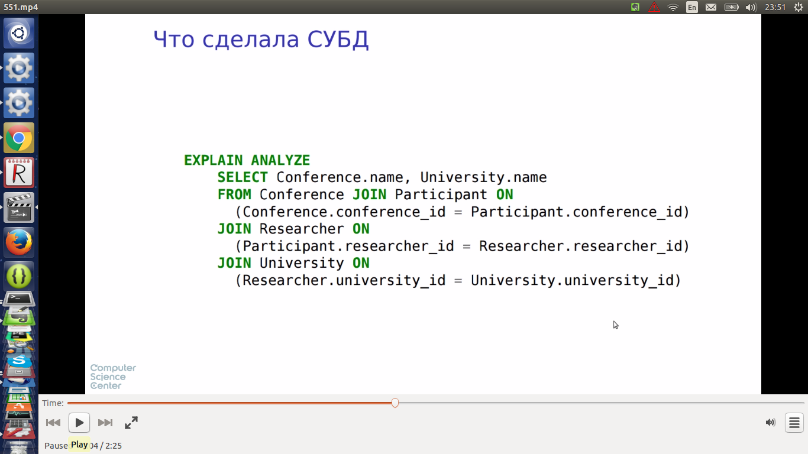
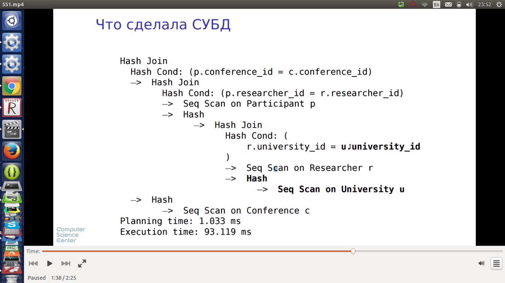
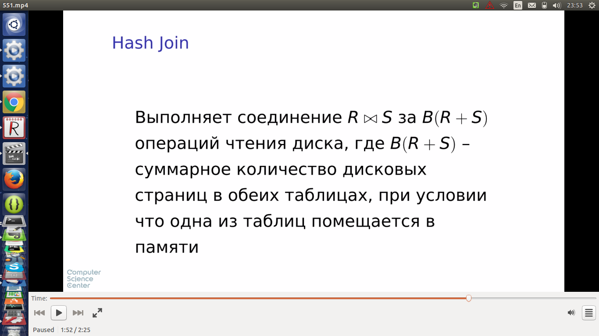
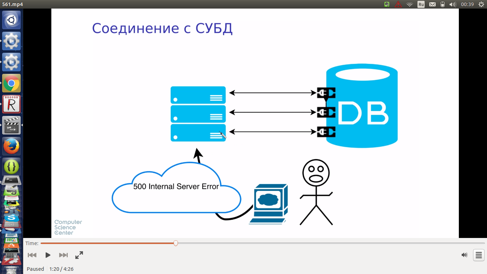
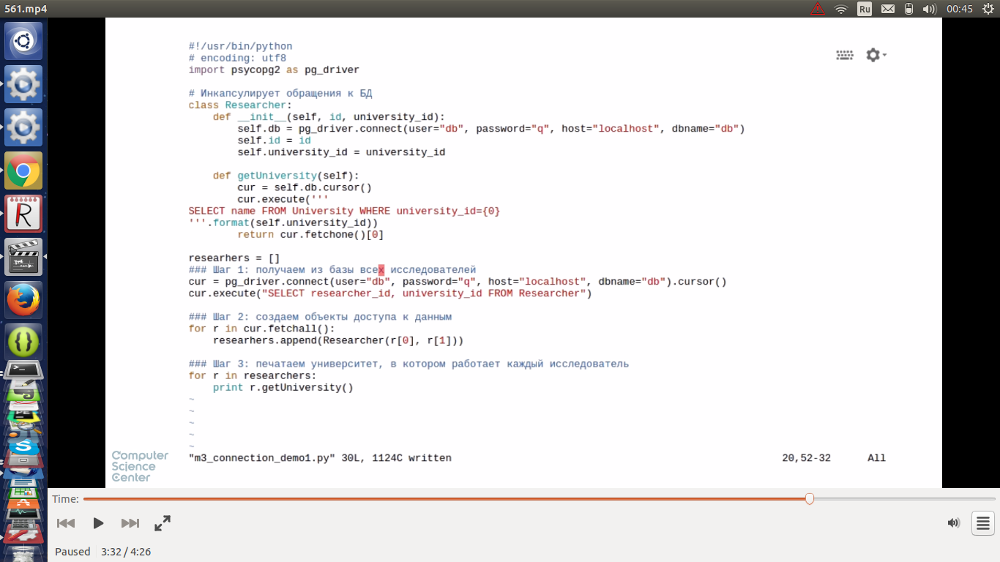

#Задача

* для каждой пары (конференция, университет) найти суммарное количество исследователей из данного университета, участвовавших в данной конференции

* код работает долго из-за большого кол-ва запросов к БД во вложенных циклах. В обработке каждого запроса есть некоторая фикс. составляющая. На ноуте 40с:



* алгоритм выполнения:  



* БД умеет хешировать нужные таблицы в памяти, что позволяет уменьшить время доступа. А также умеет организовывать выполнение запроса (если дать ей весь запрос)





* этот код работает 0.5с вместо 40с:






* hash join работает за линейное время от суммарного размера таблиц при условии, что одна из них помещается в память
* из нее делают хеш-таблицу *ключ join - список строк с данным ключом*
* при проходе другой таблицы на диске ключ join данной строки ищется в хеш-таблице, и если он есть, можно сразу делать join со списком строк, соотвествующим ключу



##Псевдокод алгоритма HashJoin

```python

#Выполняет соединение r и s по условию r.r_join_attr = s.s_join_attr
HashJoin(Relation r, Relation s, String r_join_attr, String s_join_attr):

  #проходим по всей таблице r и  
  #строим словарь с дубликатами, где ключом является значение атрибута соединения из r
  # а в списке значений содержатся строки r
  hash_multimap = new HashMultimap()
  for r_page in r.pages():
    for r_row in r_page.rows():
      hash_multimap[r_row.value(r_join_attr)].add(r_row)

  # проходим по всей таблице s и для каждой строки проверяем наличие в построенном словаре 
  # ключа равного значению атрибута соединения из s
  for s_page in s.pages():
    for s_row in s_page.rows():
      if s_row.value(s_join_attr) in hash_multimap:
        for r_row in hash_multimap.values(s_row.value(s_join_attr)):
          # Если таковой ключ найден то в результат отправляются все пары текущей строки из s
          # и списка значений из r
          emit(r_row, s_row)

```
#Приложение и сессии

* для каждой сессии БД выделяет ресурсы (память под хеш-таблицы, дисковые дескрипторы и пр). Если сессий слишком много ресурсы заканчиваются
* надо закрывать сессии!



* Приложение, плохо обращающееся с сессиями. Не закрывает соединения с БД. Может упасть при большом кол-ве исследователей в таблице (больше 100, по умолчанию принимается 100 сессий), т.к. на каждого разработчика создается отдельная сессия



```python
Что произойдет с этим скриптом, если запустить его на PostgreSQL с настройками по умолчанию?

import psycopg2 as pg_driver

# Инкапсулирует обращения к БД
class Researcher:
    def __init__(self, id, university_id):
        self.db = pg_driver.connect(user="db", password="q", host="localhost", dbname="db")
        self.id = id
        self.university_id = university_id

    def getUniversity(self):
        cur = self.db.cursor()
        cur.execute('''
SELECT name FROM University WHERE university_id={0}
'''.format(self.university_id))
        return cur.fetchone()[0]

researchers = []
### Шаг 1: получаем из базы всех исследователей
cur = pg_driver.connect(user="db", password="q", host="localhost", dbname="db").cursor()
cur.execute("SELECT researcher_id, university_id FROM Researcher")

### Шаг 2: создаем объекты доступа к данным
for r in cur.fetchall():
    researchers.append(Researcher(r[0], r[1]))

### Шаг 3: печатаем университет, в котором работает каждый исследователь
for r in researchers:
    print r.getUniversity()
В PostgreSQL существуют все необходимые объекты (пользователь, БД, таблицы), параметры соединения правильные, в таблицах есть данные и они согласованы. Всё хорошо, в общем.

На случай, если вы вдруг попробуете его на самом деле запустить: скрипт был работоспособен во время тестирования. Известно, что в некоторых случаях он работает. Если в него вдруг вкралась ошибка, сообщите о ней. Если что-то не так в вашем окружении (например остуствует модуль psycopg2) то исправьте ваше окружение. В любом случае, ответа "скрипт вообще не работает" у нас для вас нет :)
```

* Исправленный код


закрытие ресурсов

* python try-finally, with
* java try-finally, try with resources
* c++ деструкторы, умные указатели


* открытие сессии - дорогая операция
* при использовании одной сессии ускорение работы в примере в 10 раз: 80 мс против 1 с


* шаблон - пул сессий
* при работе с пулом сессию надо гарантированно вернуть в пул
* 134 мс


* иногда нужно получить один и тот же экземпляр сессии (для транзакций и пр)
* для хранения сессии можно использовать контекстный объект


###Выводы
* не перекладывай на СУБД работу БД
* закрывай сессии
* пользуйся пулом сессий
* параметризуй контекстом объекты доступа к данным
