## Схема БД

CREATE TABLE Conference (
  id SERIAL PRIMARY KEY,
  name TEXT UNIQUE);
  
CREATE TABLE Paper(
  id SERIAL PRIMARY KEY,
  title TEXT,
  conference_id INT REFERENCES Conference,
  keywords TEXT[ ],
  accepted BOOLEAN);
  
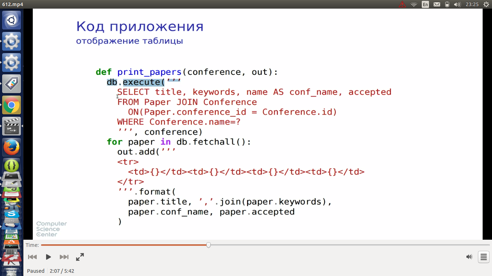

* добавили каталог ключевых слов

* добавили много конференций

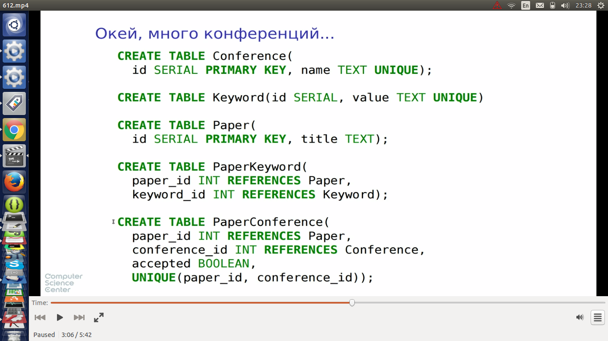

* изменение кода приложения при добавлении каталога ключевых слов

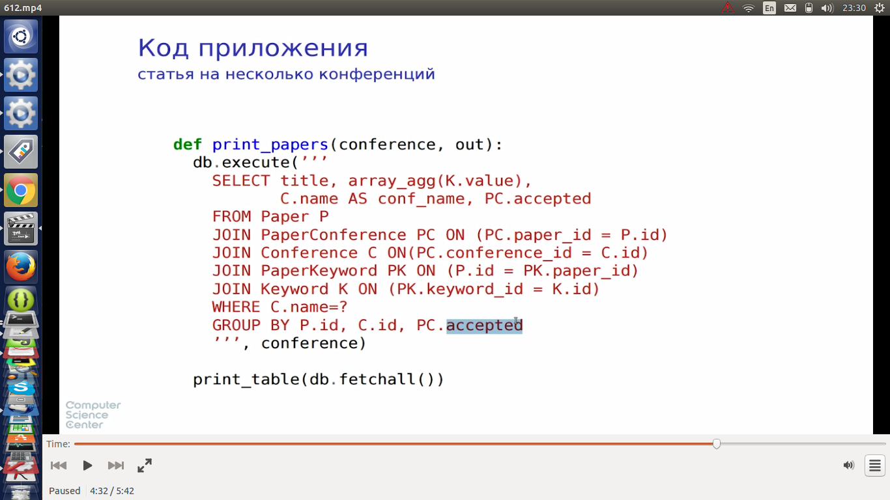

* код приложения слишком много знал про структуру БД, поэтоме его приходилось менять при каждом изменении схемы БД
* нужно писать код более независимый от структуры БД

## Представления

* виртуальная таблица, тело которой формируется некоторым запросом

пример
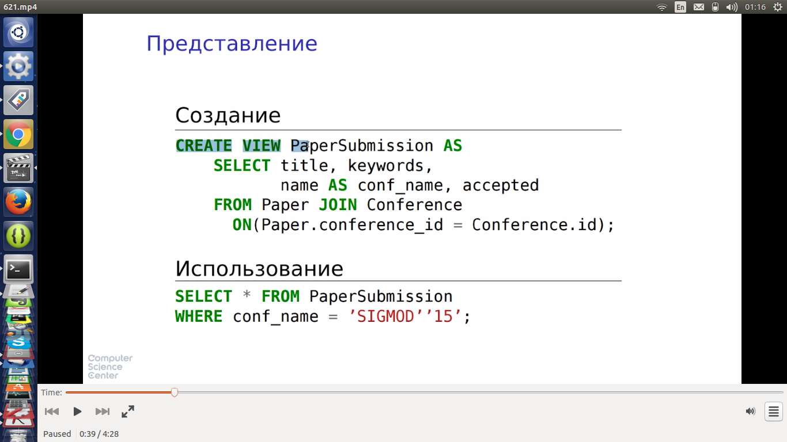

### Функции представления

* настройка схемы БД для разных ролей пользователей
* сокращение текста запросов
* разграничение прав доступа
* **интерфейс к данным:** устойчисвость приложений к изменениям. Если интерфейс представления не меняется, при изменениях в БД достаточно поменять создание представления, не трогая само приложение!

Пример: Поменяли схему БД, поменяли создание представления

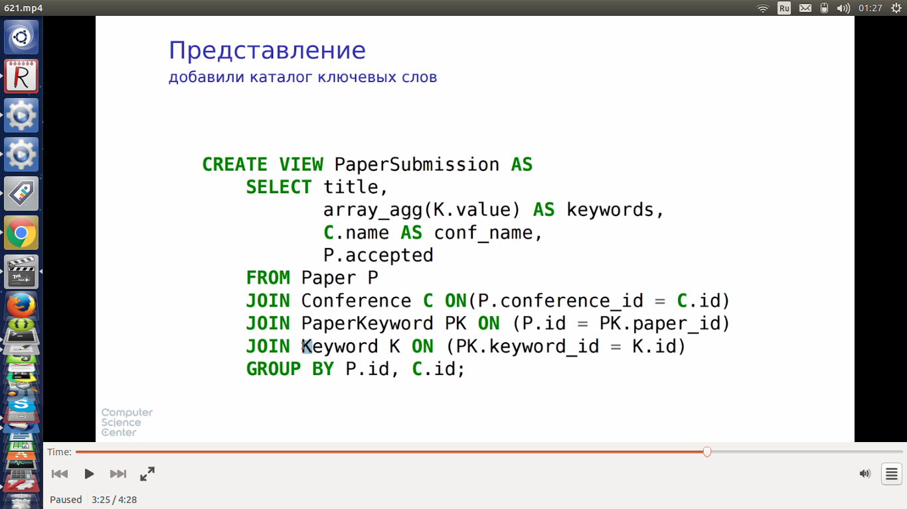

Добавили статью, изменили ключевые слова

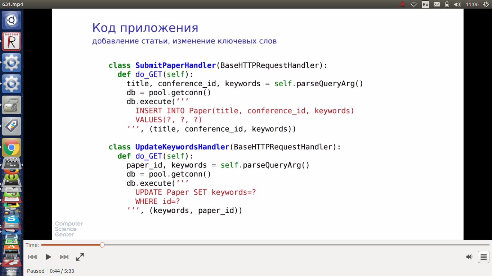

Добавили статью

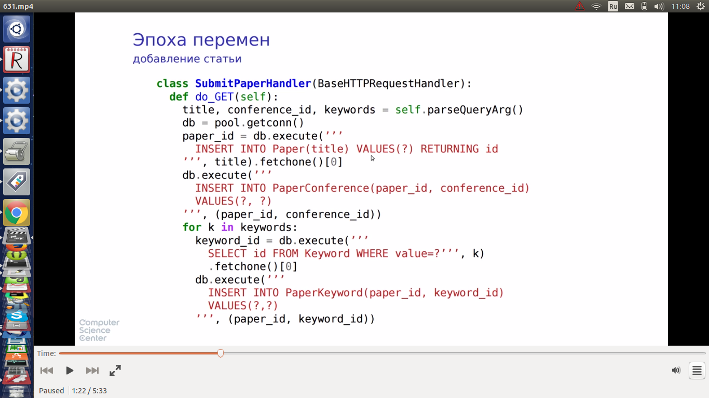

Изменение ключевых слов

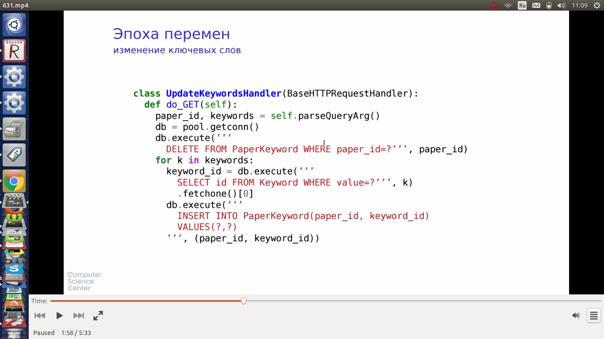

**Интерфейс операций можно сделать независящим от структуры БД!**

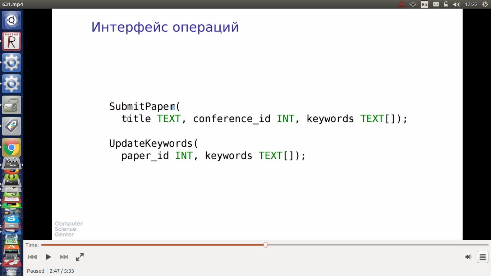

## Хранимые процедуры

* определения хранятся в БД
* + выполняются на сервере БД. Нет затрат на пересылку данных между сервером БД и сервером приложения
* + более изощренный контроль над правами доступа
* + меньше шансов на рассинхронизацию кода и данных, т.к. живут вместе
* + приложение получает API для действий над данными
* - синтаксис и поведение плохо стандартизированы (не все производители БД  придерживаются существующих стандартов, есть подводные камни, поведение разное на разных базах)
* - отладка хранимых процедур затруднена (дебаг тяжело делать)
* - код и схема БД в отрыве от приложения => есть шансы, что изменения будут рассинхронизированы. Проблема контроля версий (миграции кода и данных), патчи к коду хранимых процедур
* худший вариант - разбросать по всему коду операторы, читающие и изменяющие данные

пример процедуры submit paper

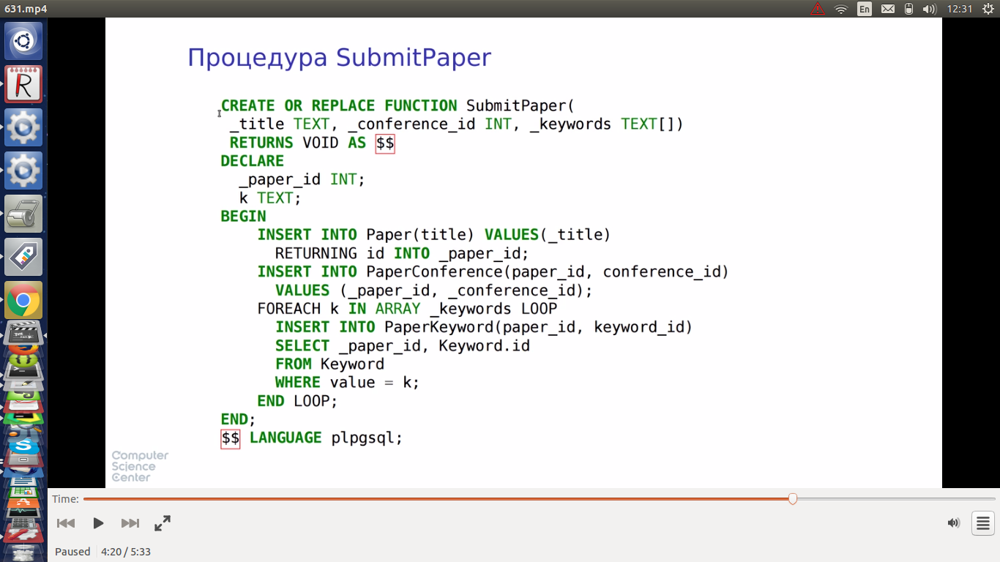

* пример взаимодействие из кода на java

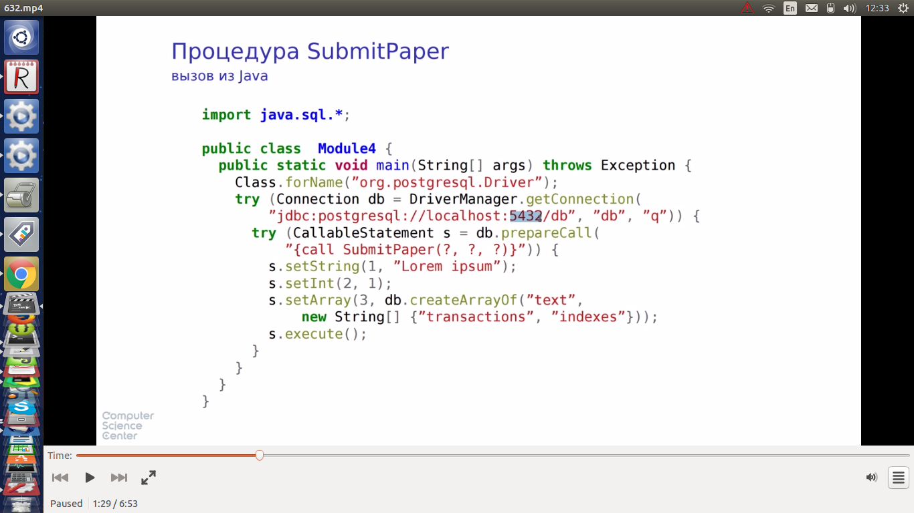

## Взаимодействие между приложением и БД

* несоответсвие интерфейсов. Данные таблично-ориентированны, приложение объектно-ориентированно
* низкоуровневые интерфейсы - драйверы для всех основных БД для основных языков программирования
* объектно-реляционные отображения, независящие от конкретной БД. минусы - используется "наибольший общий делитель" всех БД, неиспользуются фичи конкретной БД, которая сейчас используется, либо (для использования большего функционала) дописываются аннотации и конфигурац. файлы
* no sql - старые интерфейсы не работают / работают неэффективно
* Выход: использование собственного интерфейса для доступа к данным

## Независимость от реализации (один из подходов)

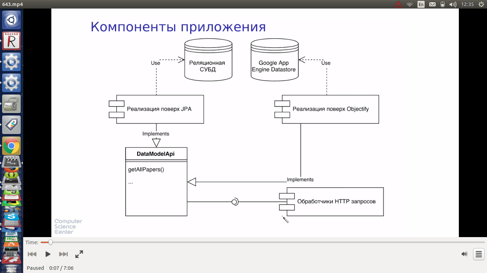

* **643, 644 - вбить код  и погонять!!!**
* 
