# Aggregate functions

721 2.05
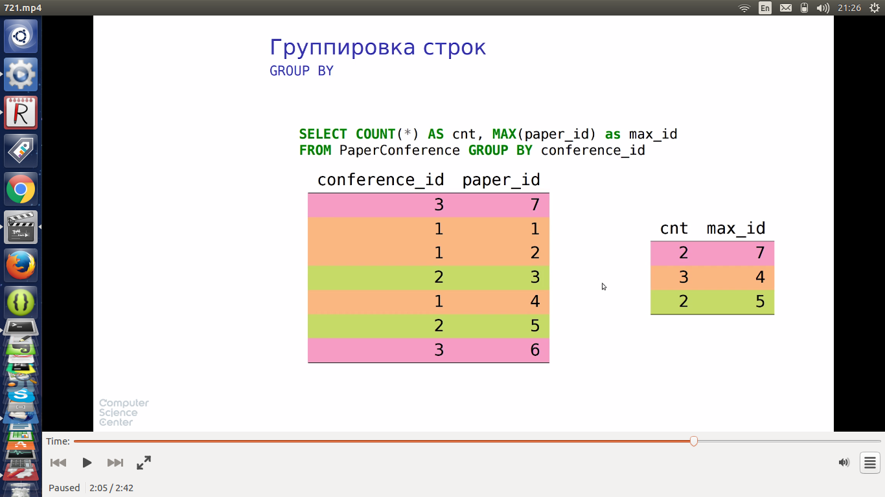

* работать не будет

722 1.05 
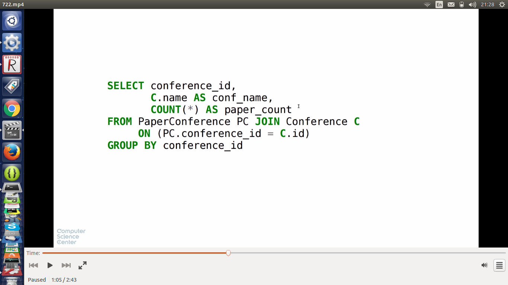

* вот такой будет

722 1.25
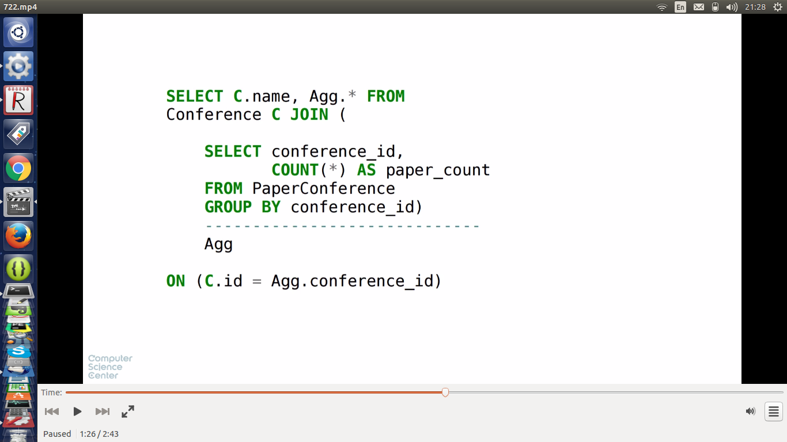

* или

722 2.14
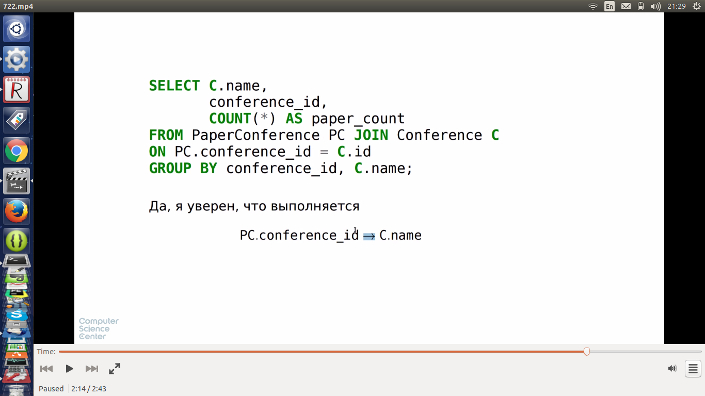

* Порядок вычисления
  * from where
  * group by
  * having
  * select

* выглядит сложно, но всего лишь находит те статьи в которых 2 ключевых слова, поданные на конференции на которые всего подано больше чем 100 статей
 
731 0.12
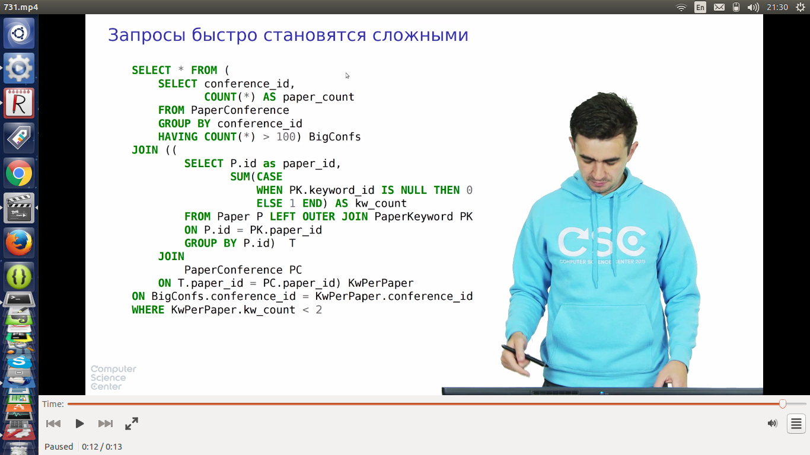

* упрощения запроса через представления

732 0.39
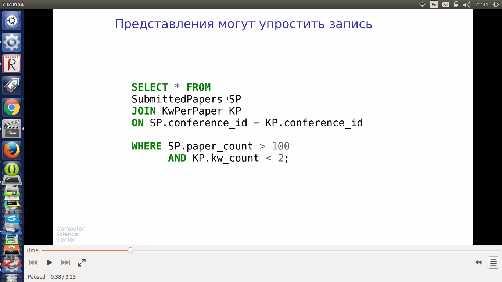

* представления - часть схемы БД. Может не быть прав на изменение схемы
* представление должно иметь смысл и быть полезным в рамках всей БД, а не только одного запроса
* лучше использовать обобщенные табличные выражения.
  * WITH и затем идет локальное представление
  * MySql их не поддерживает

732 1.55
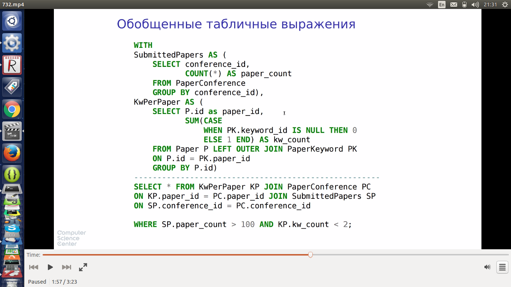

* часто нужно знать, что внутри группы - например для каждой конференции каждого года узнать отношение кол-ва статей поданных в этом году на конференцию к среднему значению статей, поданных на конференцию за все время ее проведения
* решить можно так

741 1.06
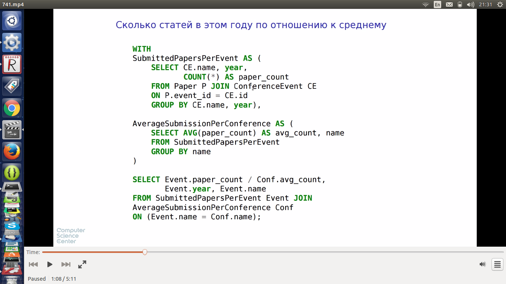

## Оконная функция

* относительно новая фича
* разбивает выборку на партиции (аналогично группировке строк)
* каждая партиция сортируется по указанному в запросе признаку
* select кроме текущей строки может оперировать с окном, состоящим из строк из той же партиции
* MySql и Sqlite не поддерживают

741 3.13
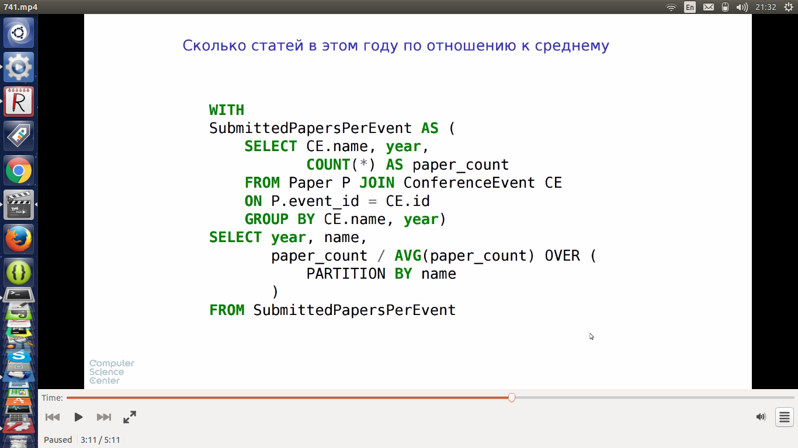

741 4.13
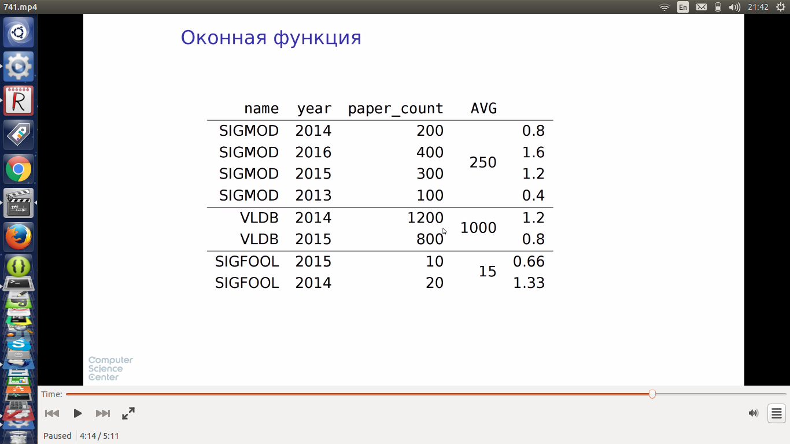

741 4.59

742 0.10
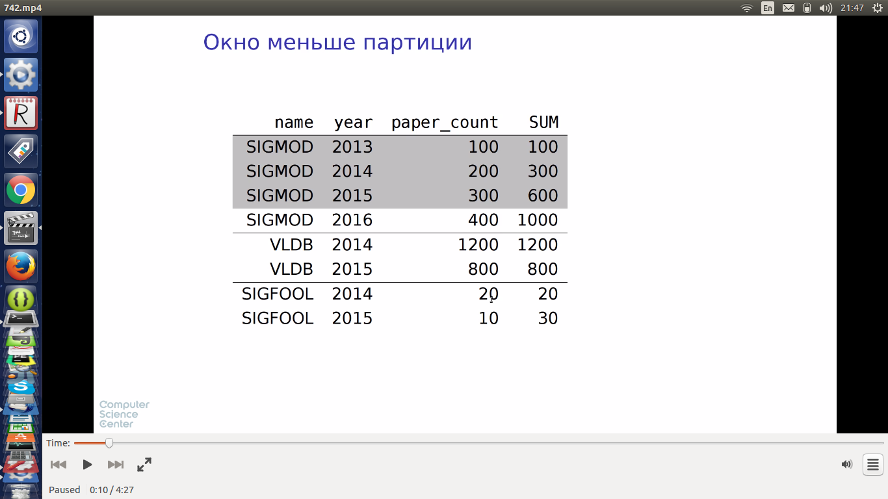
* если партиция неупорядоченна, значения аггрегатной функции вычисляется по всем строкам попавшим в одну партицию 
* если партиция упорядоченна при помощи order by в дело вступает окно и аггрегатная функция вычисляется для строк которые в настоящий момент составляют содержимое окна 
* по умолчанию окно начинается с первой строки партиции и заканчивается на той строке, которая в настоящий момент обрабатывается
* если бы была еще одна конференция с 2015 годом, она бы тоже попала в обработку
742 1.10

* FIRST_VALUE - аггрегатная функция, возвращающая первое значение из данного ей окна
* between 1 preceding and current row - в окно входят строкии из диапазона: одна предыдущая строка относительно текущей строки и текущая строка
* FIRST_VALUE в данном случае вернет значение предыдущей строки

742 1.30
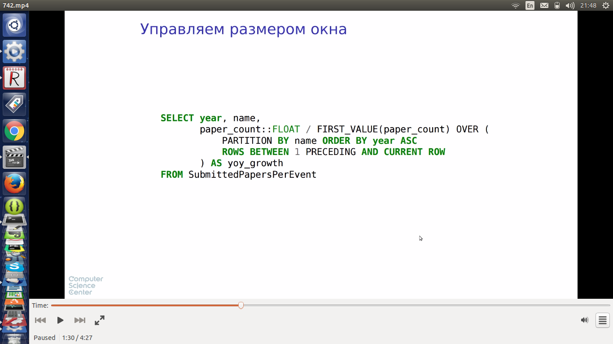

2.04
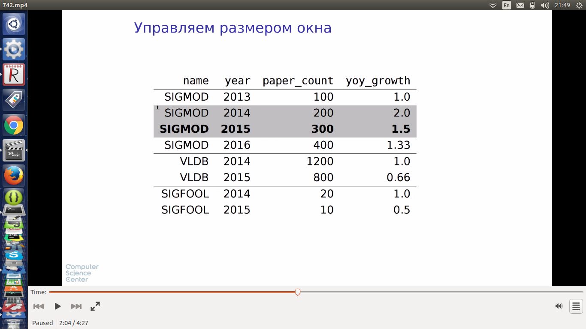

2.23
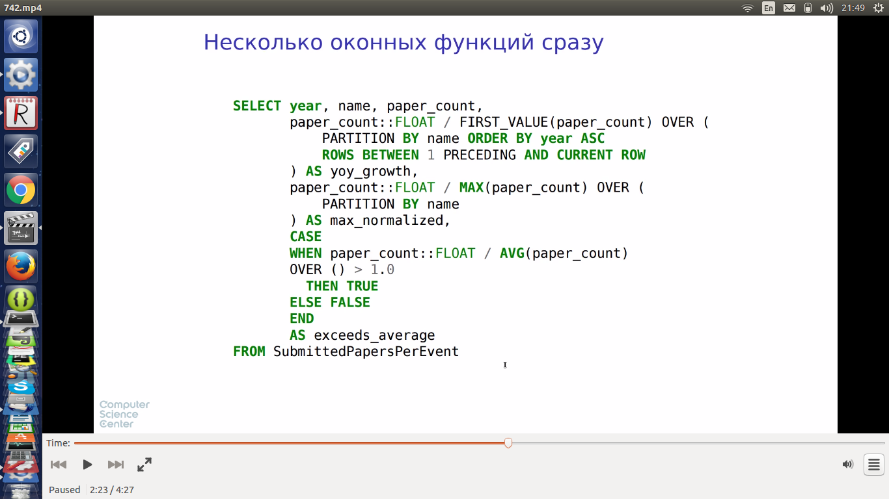

3.12
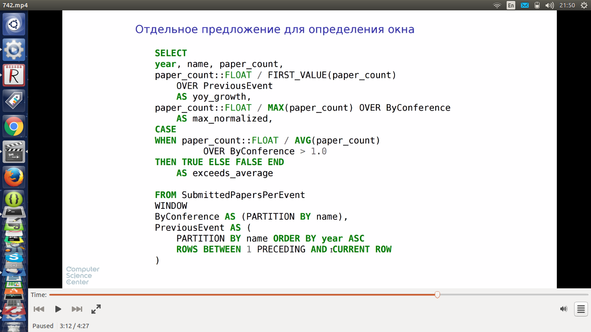

