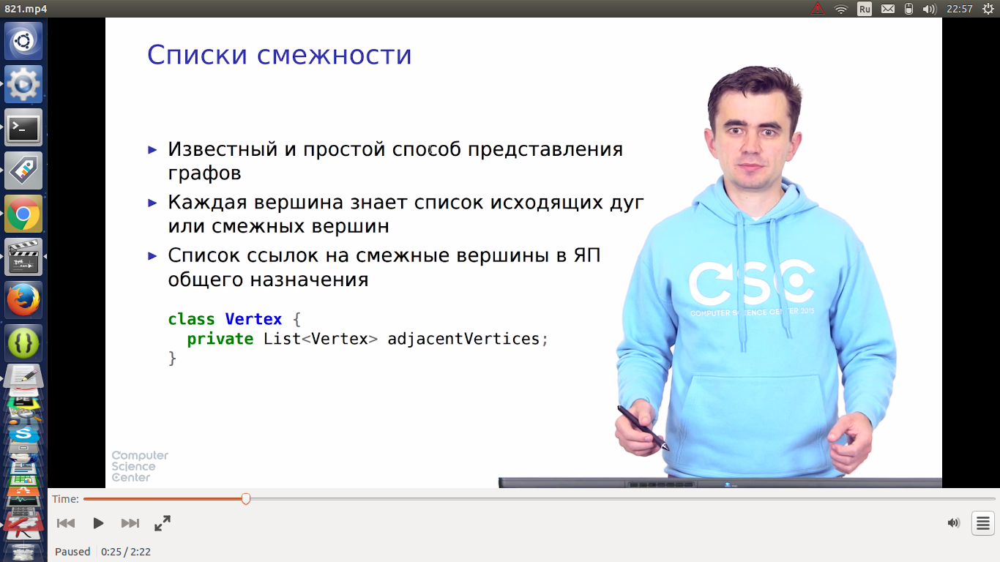
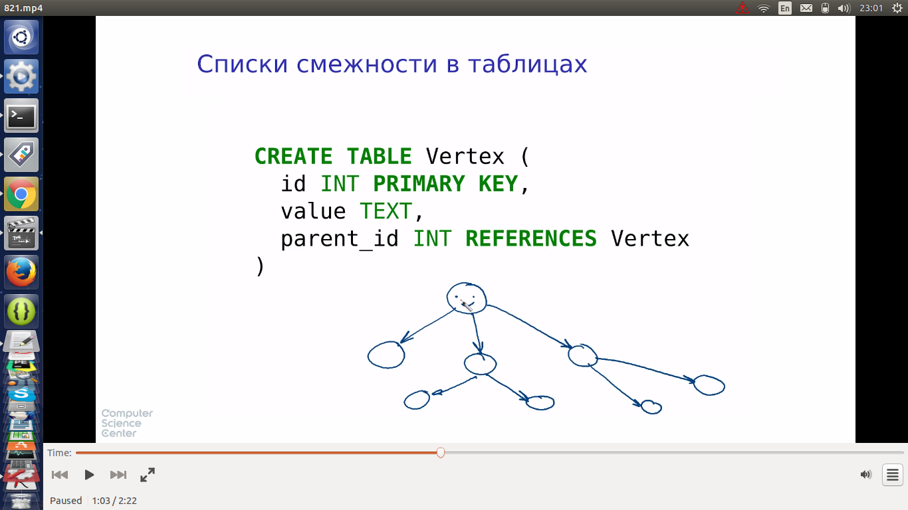
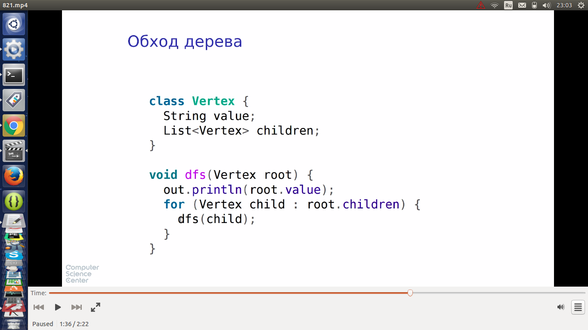
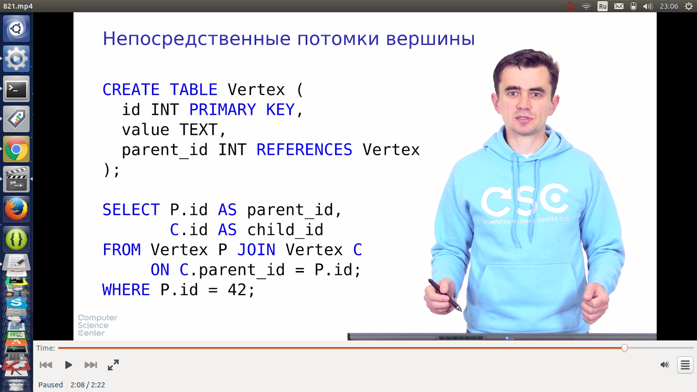
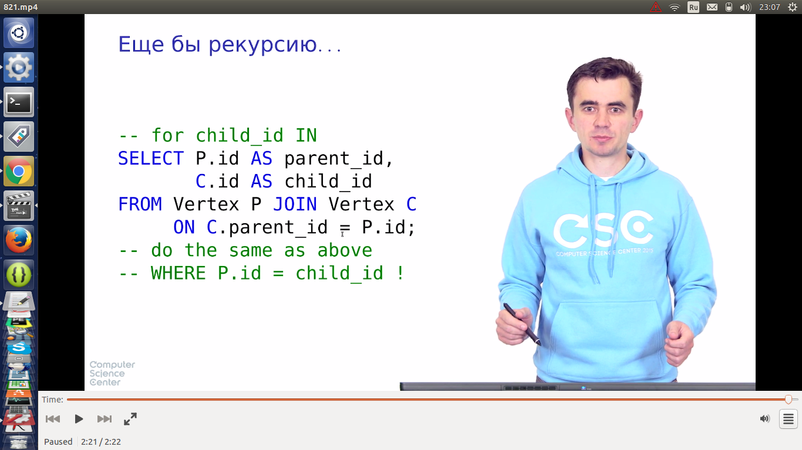
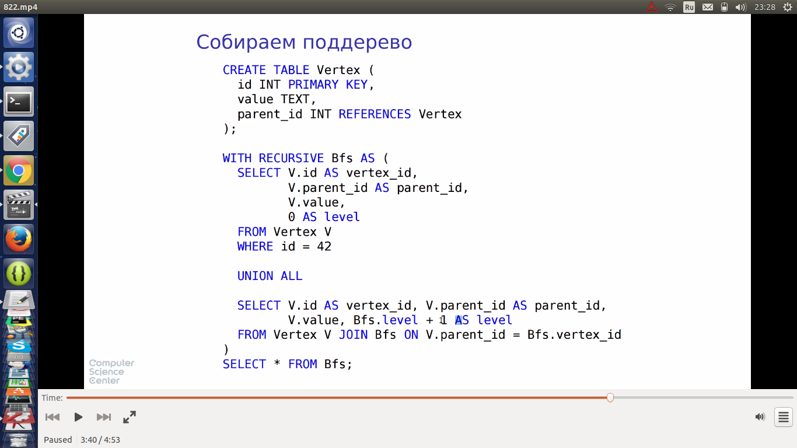

# Деревянные структуры и рекурсивные запросы

## Списки смежности и рекурсивные запросы

* дети - родитель, связь многие к одному

* есть таблица результата и рабочая таблица
* результат базы записывается в обе таблицы (первоначальная операция, выполняется 1 раз?)
* рекурсивная часть. from fibonacci относится к рабочей таблице
  * результат выполнения рек. части дописывается к таблице результата, а также заменяет строку в рабочей таблице

